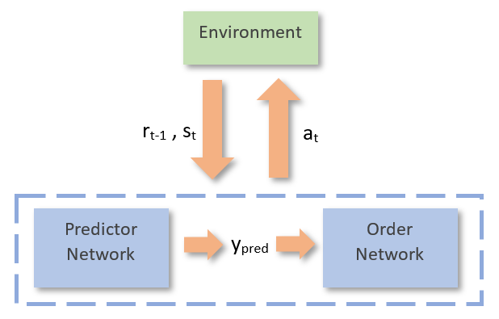
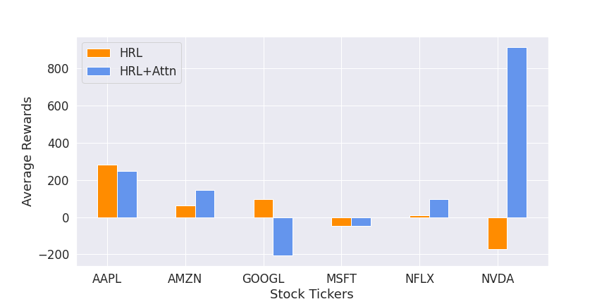
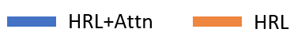

# Attentive Hierarchical Reinforcement Learning for Stock Order Executions  

[Karush Suri](https://karush17.github.io/), Shashank Saurav  

Implementation of a hierarchical-attention based agent for trading applications using Q-Learning. The agent consisting of predictor and order sub-agents learns to trade on volatile stock sequences from the S&P500 market index in the custom-designed TradeEnv real-market simulation environment. Both sub-agents operate in coordination with each other by predicting the price and ordering a bid of buy/sell on the predicted price. This is carried by attending to past price sequences and obtaining price context vectors corresponding to each input price sequence. The model achieves competitive performance in comparison to modern-day trading algorithms by demonstrating higher rewards in the form of profit and higher risk free returns in the form of Sharpe Ratios. 

<p align="center"></p>

# Dependencies  
```
1. Python >= 3.5  
2. PyTorch >= 1.4  
3. Gym >= 0.17.1  
4. Stable-Baselines >= 2.9.0  
5. Pandas >= 1.0.3  
6. Numpy  
```  

# Methods
The trading agent buys/sells shares from a given ticker listed on the S&P500 index. The predictor model observes the current state which is a sequence of past six prices and predicts prices corresponding to the next-time step.  The order model observes the current price along with state in order to yield an action using Q-Learning. Both models make use of causal self-attention in memory cells in order to learn adverse trends and thus, depict robust behavior to market fluctuations. 

Find out more-  
 * [Tutorial](https://nbviewer.jupyter.org/github/karush17/PyTorch-Tutorials/blob/master/Tutorials/Reinforcement%20Learning/2516_Project.ipynb)  

# Results

<center>Performance Comparison of Hierarchical Attention with a conventional RL trading scheme</center>  
<p align="center"></p>  

<center>Average Rewards obtained over top S&P500 tickers during the COVID-19 outbreak</center>  
<p align="center"></p>  
<p align="center"></p>  
<p align="center"></p>  

<center>Model optimization in the presence of Hierarchical Attention</center>  
<p align="center"></p>  
<p align="center">  
</p>  


